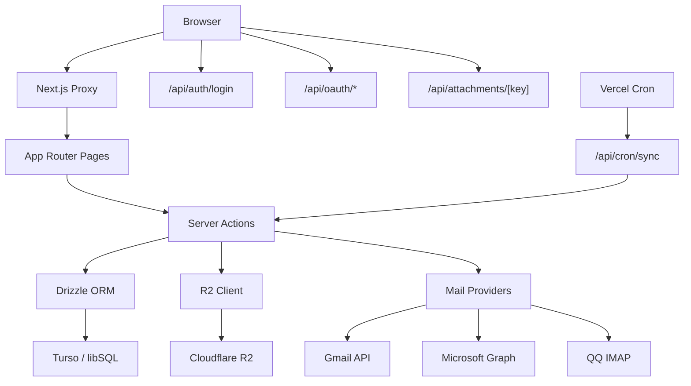
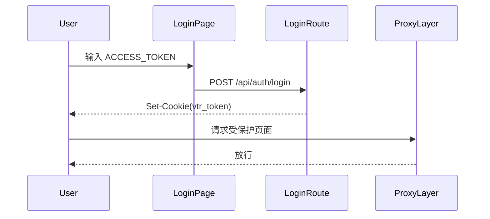
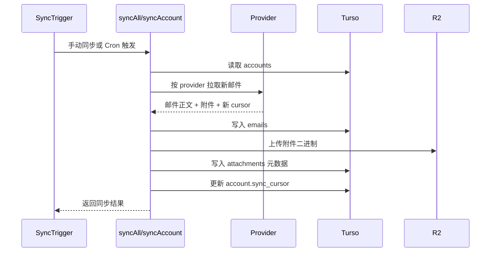

# Architecture

本文档说明 VTR-box 的实际运行架构、数据流和安全边界，便于后续维护和扩展。

## 1. 系统定位

VTR-box 是一个单用户、Serverless 的统一收件箱系统。

它的核心目标是：

- 聚合多个邮箱账号的收件内容
- 把邮件正文和索引放在 Turso
- 把附件二进制放在 Cloudflare R2
- 用 Next.js 的 `Server Actions` 作为内部读写主通道
- 用少量 `Route Handlers` 处理 OAuth 回调、登录、附件代理和 Cron

## 2. 高层架构

## 3. 运行边界

### 3.1 浏览器层

浏览器只负责：

- 登录提交访问口令
- 触发 `Server Actions`
- 展示邮件列表、详情和附件入口
- 跳转到第三方 OAuth 授权页

浏览器不会直接接触：

- Turso 凭据
- R2 密钥
- Gmail / Outlook OAuth client secret
- QQ IMAP 授权码

### 3.2 Proxy 鉴权层

`src/proxy.ts` 负责应用网关：

- 放行 `/login`
- 放行 `/api/auth`
- 放行 `/api/oauth/*`
- 放行 `/api/cron/sync`
- 其他页面和接口要求 `vtr_token` Cookie 或 `Authorization: Bearer <token>`

这意味着应用本体默认处于受保护状态。

### 3.3 应用层

应用层分成三类：

- `App Router Pages`：渲染页面
- `Server Actions`：内部业务逻辑和读写入口
- `Route Handlers`：对外部系统或二进制流开放的入口

## 4. 为什么以 Server Actions 为主

VTR-box 的内部读写采用 `Server Actions`，而不是为每个列表、详情、操作都再包一层 `/api/*`。

这样做的好处：

- 页面读取路径更短
- 不需要维护额外的 REST DTO
- 可以直接使用 `revalidatePath("/")` 刷新页面数据
- 业务逻辑更集中在 `src/actions/`

当前保留的 `Route Handlers` 只有这些：

- `POST /api/auth/login`
- `GET /api/oauth/gmail`
- `GET /api/oauth/outlook`
- `GET /api/attachments/[key]`
- `GET /api/cron/sync`

## 5. 核心数据流

### 5.1 登录流

说明：

- 登录页只校验 `ACCESS_TOKEN`
- 成功后通过 `httpOnly` Cookie 持久化 30 天
- 之后所有受保护页面都由 `proxy.ts` 统一验证

### 5.2 页面读取流

主页 `/` 的服务端页面会直接调用：

- `getEmails()`
- `getAccounts()`

随后把初始数据传给 `InboxView`。客户端搜索、打开邮件详情时，再继续调用：

- `getEmails({ search })`
- `getEmailById(id)`
- `getEmailAttachments(id)`

邮件标已读、标星由：

- `markRead(emailId)`
- `toggleStar(emailId)`

完成后通过 `revalidatePath("/")` 更新视图。

### 5.3 同步流

同步入口有两个：

- 手动同步：页面按钮调用 `syncAccount()` 或 `syncAll()`
- 定时同步：`/api/cron/sync` 调用 `syncAll()`

### 5.4 OAuth 接入流

OAuth 接入分成两段：

1. 前端通过 `src/actions/oauth.ts` 获取授权 URL
2. 第三方回调到 `/api/oauth/gmail` 或 `/api/oauth/outlook`

回调成功后：

- 交换 token
- 获取邮箱身份信息
- 写入 `accounts`
- 凭据加密后存库

### 5.5 附件下载流

附件下载不把真实 R2 Object Key 暴露给客户端。

实际流程：

1. 页面拿到附件记录 `id`
2. 浏览器访问 `/api/attachments/[attachmentId]`
3. 服务端用 `attachmentId` 查询数据库
4. 取出 `r2ObjectKey`
5. 从 R2 拉流并回传浏览器

这样客户端只看到应用层附件 ID，看不到真实对象路径。

## 6. 数据模型

### 6.1 `accounts`

用途：保存邮箱账号连接信息。

关键字段：

- `provider`：`gmail | outlook | qq`
- `email`
- `displayName`
- `credentials`：加密后的凭据 JSON
- `syncCursor`：同步游标
- `lastSyncedAt`

### 6.2 `emails`

用途：保存邮件正文、摘要、状态和收件信息。

关键字段：

- `accountId`
- `messageId`
- `subject`
- `sender`
- `recipients`
- `snippet`
- `bodyText`
- `bodyHtml`
- `isRead`
- `isStarred`
- `receivedAt`
- `folder`

去重策略：

- `(accountId, messageId)` 唯一索引

### 6.3 `attachments`

用途：保存附件元数据。

关键字段：

- `emailId`
- `filename`
- `contentType`
- `size`
- `r2ObjectKey`

说明：

- 数据库存元数据
- R2 存二进制内容

## 7. Provider 适配策略

| Provider | 接入方式 | 游标 | 说明 |
|---|---|---|---|
| Gmail | Gmail API | `historyId` | 首次拉取 INBOX，后续用 history 增量同步 |
| Outlook | Microsoft Graph API | `deltaLink` / `nextLink` | 使用 delta 查询，必要时自动刷新 token |
| QQ 邮箱 | IMAP | `UID` | 用授权码登录 `imap.qq.com`，按 UID 增量拉取 |

统一抽象在 `src/lib/providers/types.ts`：

- `EmailProvider`
- `SyncResult`
- `SyncedEmail`
- `SyncedAttachment`

这样同步层只关心统一输出，不关心底层协议细节。

## 8. 安全模型

### 8.1 访问控制

- 页面和大部分接口都受 `ACCESS_TOKEN` 保护
- 登录后转成 `httpOnly` Cookie
- API 也支持 Bearer Token 访问

### 8.2 外部系统保护

- `CRON_SECRET` 保护 `/api/cron/sync`
- OAuth client secret 只在服务端使用
- QQ IMAP 授权码不进入前端 bundle

### 8.3 凭据存储

- Gmail / Outlook token
- QQ 邮箱授权码

都会先经过 `src/lib/crypto.ts` 中的 `AES-256-GCM` 加密，再写入数据库。

## 9. 缓存与渲染

- `src/app/(app)/layout.tsx` 使用 `dynamic = "force-dynamic"`
- 主要原因是应用区严重依赖运行时数据库与鉴权信息
- 数据变更后使用 `revalidatePath("/")` 刷新首页数据

## 10. 当前边界与限制

当前实现聚焦“统一收件箱”，并不包含：

- 发信能力
- 多用户与角色系统
- 全量文件夹映射
- 邮件标签/规则系统
- 富文本清洗与安全沙箱

如果后续要扩展，优先建议沿着这几个方向演进：

- 增加 provider 抽象能力
- 把 `folder` 与 provider 文件夹映射做得更完整
- 为邮件同步引入更细粒度的日志和任务状态
- 为搜索加入全文索引
